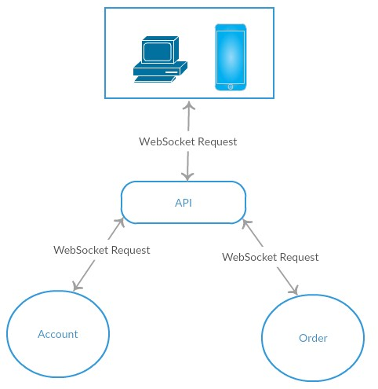
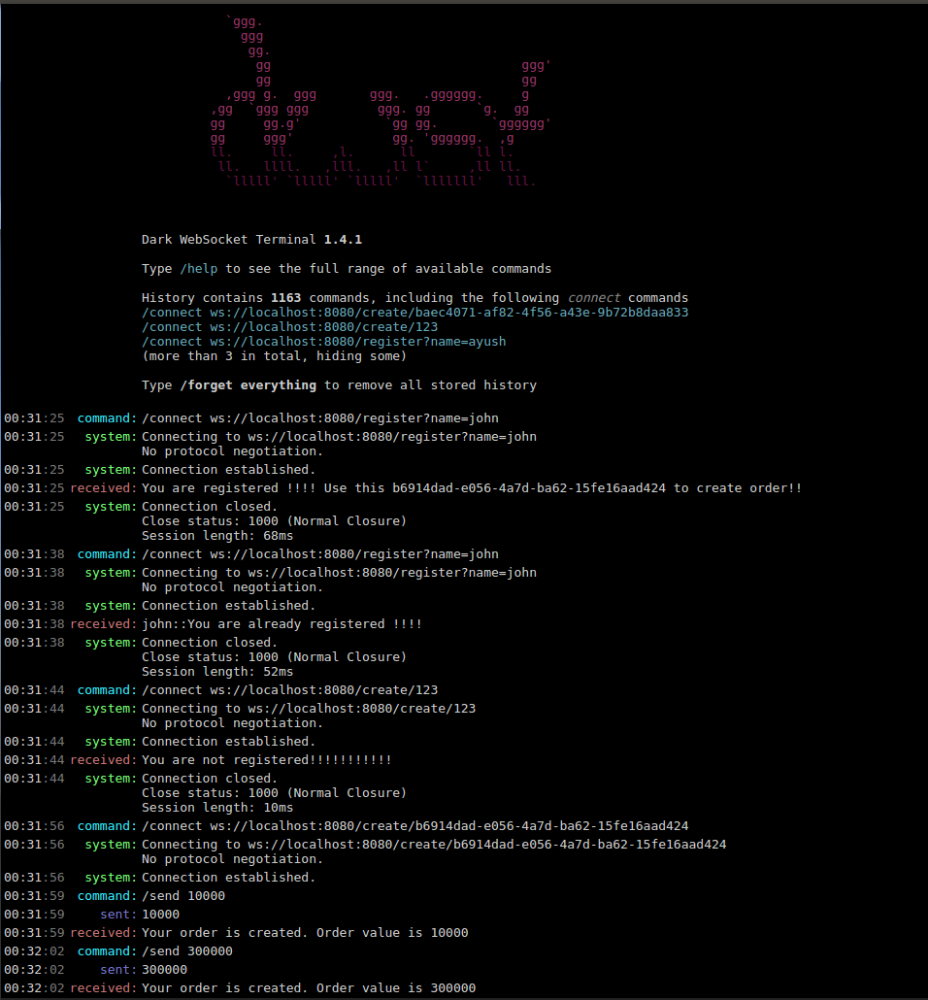

# akka-http-websocket-microservices

**Steps to test example manually**

- Open 3 terminals
- Execute `sbt "project api" run` from first terminal.
- Execute `sbt "project account" run` from second terminal.
- Execute `sbt "project order" run` from third terminal.
- Download `Dark Websocket terminal` web socket client extension of google chrome

